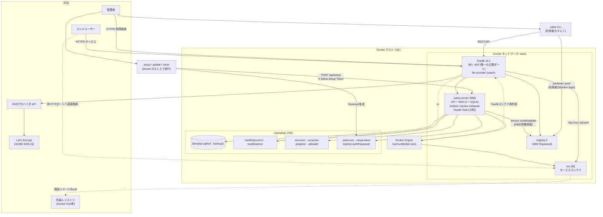

# 差配(Sahai) 全体構成

システム全体を1枚で見るための図。**どの登場人物が何をするか**と**それらがどう繋がるか**だけを扱い、詳細は各ドキュメントに委ねる。

| 視点 | ドキュメント |
|---|---|
| 何を作るか(仕様の正) | [requirements.md](./requirements.md) |
| コンテナ・ホスト側の配置 | [container-design.md](./container-design.md) |
| Control Planeプロセス内部のモジュール | [backend-architecture.md](./backend-architecture.md) |
| 操作ごとの時系列 | [sequences.md](./sequences.md) |
| APIの形 | [api-design.md](./api-design.md) |

## 1. 登場人物

| 登場人物 | 位置 | 役割 |
|---|---|---|
| 管理者 | 外部 | Web UI・CLI・セットアップスクリプトの利用者。単独運用を前提とする(要件定義書2章) |
| エンドユーザー | 外部 | 登録済みサービスの利用者。管理画面には触れない |
| sahai CLI | 利用者のマシン | ビルド+push、サービスの追加、ライフサイクル操作の薄いラッパー(要件定義書12章) |
| setup / update / clean スクリプト | Dockerホスト | 初期設定・更新・初期化。`setup-token`の読み出しとレジストリの`htpasswd`生成は、これらだけが行う |
| Traefik | Dockerホスト(`sahai`ネットワーク) | 80/443の唯一の待受。file providerでルートを読み、DNS-01で証明書を取得する |
| sahai-server (Control Plane) | 同上 | API + Web UI配信 + SQLite + Docker操作 + ヘルスチェック。外部には公開せずTraefik経由で到達する |
| registry | 同上 | 同梱の`registry:2`。htpasswd認証 |
| サービスコンテナ `svc-{id}` | 同上 | 利用者が登録したサービス。sahai-serverが`docker run`/`docker compose`で起動する |
| Docker Engine | Dockerホスト | 実際のコンテナ実行。sahai-serverが`/var/run/docker.sock`経由で操作する |
| `/var/sahai/` | Dockerホスト | すべての永続化データ(要件定義書3章) |
| Let's Encrypt / DNSプロバイダAPI | 外部 | DNS-01チャレンジによる証明書の取得・更新 |
| 外部レジストリ(Docker Hub等) | 外部 | compose型サービスが`build:`を持たない既製イメージを取得する先。**差配の資格情報は送らない**(要件定義書7章) |

意図的に**持たない**もの: 通知基盤(8章)、ログ収集基盤(9章)、メトリクス基盤(10章)、ジョブキュー(12章)、独立したWeb UIコンテナ(3章)、外部DBサーバー。

## 2. 全体構成図

## 3. リクエストのルーティング

Traefikのルート定義はすべてsahai-serverが`/var/sahai/traefik/dynamic/`へ書き出す。Traefikはfile providerのwatchで拾うため、リロード指示は不要(詳細は[container-design.md](./container-design.md) 4章)。

| ホスト名 | 転送先 | 生成タイミング | priority |
|---|---|---|---|
| `sahai.<domain>` | `sahai-server:8080` | 起動時に`static-routes.yml`へ1回 | 100 |
| `registry.sahai.<domain>` | `registry:5000` | 同上 | 100 |
| `<サービス名>.<domain>`(`is_http`あり) | `svc-{ServiceContainer.id}:{container_port}` | start/restartのたびに冪等生成 | 既定 |
| `<サービス名>.<domain>`(`is_http`なし) | `sahai-server:8080`(Not Serviceページ) | 同上 | 既定 |
| `*.<domain>`(どれにも一致しない) | `sahai-server:8080`(サービスが見つかりません) | 起動時に1回 | 1 |

`is_http`のポートはホストに公開しない。Traefikは同じ`sahai`ネットワーク上のコンテナ名で直接到達する(要件定義書6章)。ホストに公開されるのは`is_http`以外のポートだけで、そちらはTraefikを介さない。

## 4. イメージのビルド経路は2つある

どちらの経路でも、レジストリ上のイメージ名とサービス名の名前空間は一致する(要件定義書5章)。

| | `sahai container push` | `sahai service create` / `service update` |
|---|---|---|
| ビルド場所 | 利用者のマシン | sahai-server(サーバー側) |
| レジストリ資格情報 | 利用者ローカルの`docker login` | DBの`registry_username`/`registry_password` |
| 事前のサービス登録 | 必須(未登録ならエラー) | `create`は不要 / `update`は必須 |
| 送るもの | ビルド済みイメージ | プロジェクトのtar.gz |
| シーケンス | [sequences.md](./sequences.md) 2章 | [sequences.md](./sequences.md) 2.5章 |

image型サービスの`docker pull`もサーバー側で行うため、DBの資格情報を使う(bollardは`~/.docker/config.json`を参照しないため明示的に添える。要件定義書7章)。

## 5. データの置き場所

生成されるデータはすべて`/var/sahai/`配下に集約し、リポジトリのディレクトリには置かない。内訳と各ファイルのパーミッションは[requirements.md](./requirements.md) 3章・4章、置き方の理由は[container-design.md](./container-design.md) 3章を参照。

**最重要の制約**: sahai-serverコンテナは`/var/sahai`を**ホストと同一パス**でマウントする。bollard/`docker compose`へ渡すバインドマウント元がホスト側のパスとして解釈されるため、ここがずれるとサービスのボリュームが壊れる(Docker-out-of-Dockerの典型的な罠)。
