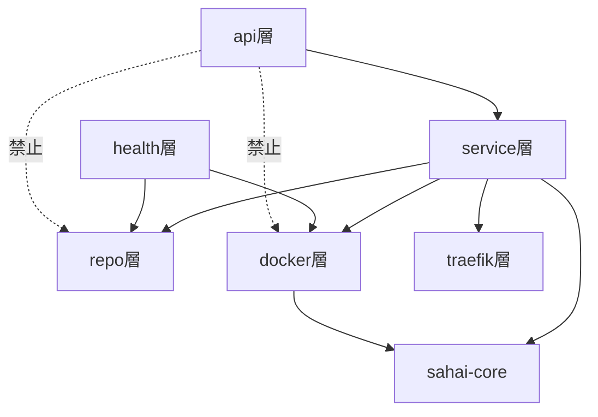

# 差配(Sahai) バックエンド モジュール構成

[requirements.md](./requirements.md)・[api-design.md](./api-design.md)・[sequences.md](./sequences.md)で決めた機能を実装するための、Rustコード側のモジュール構成を設計する。[sequences.md](./sequences.md)がシステムコンポーネント間(Web UI/CLI/Docker/Traefik等)の視点だったのに対し、本ドキュメントは**Control Planeプロセス内部のモジュール間**の視点で書く。

## 1. クレート構成(Cargo workspace)

```
sahai/                          (workspace root)
├── Cargo.toml
├── migrations/                 (sahai-serverが読む。既存)
└── crates/
    ├── sahai-core/             (依存なしの純粋ロジック。sahai-server/sahai-cli両方から使う)
    ├── sahai-server/           (Control Plane本体。axum + sqlx + bollard)
    └── sahai-cli/              (CLIバイナリ `sahai`)
```

3分割にした理由: `sahai-server`(Dockerホスト上で常駐)と`sahai-cli`(ビルド元マシンで実行)は別々にデプロイされるプロセスだが、**composeサービス名のバリデーション・タグ長チェック**は要件定義書6章・12章で「同じロジックを共有する前提」と明記されており、実際にコードを共有できないと実装時に確実にズレる。そのため純粋ロジックだけを`sahai-core`に切り出し、I/O(DB・Docker・HTTP)を持たせない。この切り分けは[test-strategy.md](./test-strategy.md)の「単体テスト対象(純粋ロジック)」ともそのまま対応する。

## 2. sahai-core

| モジュール | 責務 | 対応するtest-strategy.mdの項目 |
|---|---|---|
| `validation` | サービス名パターン・composeサービス名の文字種・タグ長(128文字)・ホストポートの有効値と予約ポートの検証関数群 | 2章の小節「6章: サービス登録機能」 |
| `naming` | `svc-{id}`系のコンテナ名/プロジェクト名生成、レジストリタグ生成(`<service-name>[-composeサービス名]`)、ボリュームホストパス生成(`/var/sahai/services/<id>/<正規化パス>/`) | 2章の小節「6章: サービス登録機能」「7章: 起動・停止・削除」 |
| `compose` | docker-compose YAMLのパース(サービス名一覧・`build:`保有サービスの抽出)、新旧サービス名集合からのdiff算出(新規/削除/継続) | 2章の小節「6章: サービス登録機能」内の「compose_contentの diff ロジック」 |

(test-strategy.mdの2章「単体テスト対象」は、要件定義書の章番号をそのまま小節名に使っているため、上表の「6章」等はtest-strategy.md自体のトップレベル章番号ではない点に注意)

いずれも`Result<T, CoreError>`を返す同期関数のみで構成し、非同期ランタイム・DB接続・ファイルI/Oに依存しない(依存クレートはYAMLパーサ等の最小限に留める)。

## 3. sahai-server

### レイヤー構成

```
sahai-server/src/
├── main.rs         起動処理: config読込 → DBプール作成 → 設定シード → Traefik整合 → axum Router組立 → Health Taskをtokio::spawn
├── config.rs        環境変数からのブートストラップ値(bind_addr・データルート・DBパス等)
├── settings.rs       実行時に変更可能な設定(SharedSettings)。正はDBで、環境変数は初回起動時のシード用
├── state.rs           AppState(DBプール・SharedSettings・Config等の共有状態)
├── domain.rs           ドメインモデル(repo層の行とapi層のDTOの間に立つ内部型)
├── error.rs             AppError(全レイヤー共通のエラー型)。IntoResponseでapi-design.md 1章のエラー形式に変換
├── auth.rs               Bearerトークン検証ミドルウェア
├── setup_token.rs         初期設定用ワンタイムトークンの生成・検証・失効(要件定義書4章)
├── env_file.rs             `.sahai.env`の特定キーだけを書き換える/追記するユーティリティ
├── fs_perms.rs              秘匿値を含むファイル・ディレクトリへの600/700適用(要件定義書4章)
│
├── api/              【HTTPハンドラ層】リクエスト⇄DTOの変換とservice層の呼び出しのみ。ビジネスロジックは持たない
│   ├── mod.rs         Router定義(認証層の内外の切り分け・SPAフォールバック・CORS)
│   ├── services.rs    サービス関連の各エンドポイント(upload/update_uploadを含む)
│   ├── setup.rs        POST /api/setup(認証層の外側。セットアップトークンで保護)
│   ├── settings.rs      基本設定・DNS/証明書設定・レジストリ設定のエンドポイント
│   ├── not_http_service.rs  GET /api/not-service(認証不要の公開API)
│   └── dto.rs            リクエスト/レスポンスのserde構造体(api-design.mdのTS型に対応)
│
├── service/          【ドメイン層】オーケストレーションとビジネスルール。sahai-coreのロジックをDB/Docker/Traefikと組み合わせる
│   ├── mod.rs
│   ├── registration.rs  登録: バリデーション→DB挿入(トランザクション)。Traefikルートはここでは生成しない(start/restart時に生成。5.1参照)
│   ├── update.rs         PUT: nameの即時反映とその他フィールドの遅延反映を分岐
│   ├── upload.rs          アップロードされたプロジェクトのサーバー側ビルド+push→登録/更新(要件定義書12章)
│   ├── compose_sync.rs     compose_content編集時のServiceContainer diff適用(core::composeを使用)
│   ├── port_check.rs        host_portの衝突検証。登録(POST)と更新(PUT)で共有
│   ├── lifecycle.rs          start/stop/restartのオーケストレーション、冪等性判定
│   ├── deletion.rs            削除フロー(Traefikルート削除→コンテナ停止→DB削除の順序制御)
│   └── settings.rs             設定保存のオーケストレーション(DB永続化+SharedSettings反映+Traefik再生成)
│
├── repo/             【DBアクセス層】sqlxクエリのみ。ビジネスロジックを持たない
│   ├── mod.rs          トランザクションヘルパー(BEGIN IMMEDIATE)
│   ├── services.rs
│   ├── containers.rs
│   ├── ports.rs
│   ├── volumes.rs
│   └── settings.rs      Settings(1行)とDnsProviderCredential
│
├── docker/            【Docker操作層】
│   ├── mod.rs           `ContainerLifecycle`トレイトの定義と、source_typeに応じた実装の選択
│   ├── image_runtime.rs    ImageRuntime: bollardでrun/stop/pull(image型のライフサイクル)
│   ├── compose_runtime.rs  ComposeRuntime: `docker compose`サブプロセスでup/down(compose型のライフサイクル)
│   ├── build_runtime.rs     `docker build`/`docker push`のサブプロセス実行(service::uploadから使う)
│   ├── registry_login.rs     `docker login`のサブプロセス実行(起動時とレジストリ設定保存時)
│   ├── override_gen.rs        compose型のoverride.yml生成(core::composeとnamingを使用)
│   ├── log_stream.rs           コンテナログの読み出し(SSE配信用。保存も加工もしない)
│   └── inspector.rs             bollardでのinspect/stats。**source_typeに関わらず共通**(下記コラム参照)
│
├── traefik/           【Traefik操作層】
│   ├── route_writer.rs   ルートYAML生成・書き込み・削除。is_httpの有無で実サービス(コンテナ宛て)/
│   │                      sahai-server自身(Not Serviceページ用)に分岐(api/not_http_service.rs参照)
│   └── container.rs       Traefikコンテナ自体の再作成(静的設定であるDNSプロバイダ/ACMEメールの反映)
│
└── health/            【バックグラウンドタスク】
    ├── mod.rs
    └── task.rs          tokio::spawnされる10秒ループ。repoとdocker::inspectorのみに依存し、api/serviceレイヤーからは独立
```

`api/not_http_service.rs`は`GET /api/not-service`(認証不要の公開API。api-design.md 3章参照)を提供する。以前はaxumの`.fallback()`としてTraefikからのHostヘッダー転送を直接HTML描画していたが、Not Serviceページの表示自体をWeb UI側に統一したため、現在は`authed`ルーターの外側に登録された通常のルート(`?host=`パラメータで明示的に問い合わせるJSON API)になっている。

Hostヘッダーを見るのは`api/mod.rs`のSPAフォールバックだけで、そこでの役目も「管理画面を返すか`/not-service`へ寄せるか」の振り分けに限られる(要件定義書6章「Not Serviceページへの誘導」・[container-design.md](./container-design.md) 1.5章)。サービスの特定自体は上記APIが`?host=`で受け取った値をもとに行う。

`api/mod.rs`のRouter組み立て時、`tower_http::cors::CorsLayer::permissive()`を`.layer()`で追加している([api-design.md](./api-design.md) 1章「CORS」参照)。認証層(`auth::require_bearer_token`)とは独立したレイヤーであり、認証の要否には影響しない。

### コラム: なぜ`inspector`は`ContainerLifecycle`の外に出すか

`docker run`/`docker compose up`はimage型・compose型で実装(bollard vs サブプロセス)がまったく異なるため、`ContainerLifecycle`トレイトで抽象化し`ImageRuntime`/`ComposeRuntime`を`source_type`で切り替える。一方、**実際に起動したコンテナは(image型・compose型を問わず)すべて`svc-{ServiceContainer.id}`という決まった名前を持つ**(要件定義書7章)ため、`inspect`(ヘルスチェック)や`stats`(リソース監視)はbollardで直接コンテナ名を指定して呼べばよく、type別の分岐が一切不要になる。この非対称性(ライフサイクル操作は分岐が必要、参照系操作は不要)を`docker/`モジュール内の構造にそのまま反映させている。

```rust
// docker/mod.rs (イメージ)
trait ContainerLifecycle {
    async fn start(&self, svc: &ServiceWithContainers) -> Result<(), DockerError>;
    async fn stop(&self, svc: &ServiceWithContainers) -> Result<(), DockerError>;
}
// ImageRuntime, ComposeRuntime がこれを実装。
// 選択ロジックは docker::mod の runtime_for(source_type) が持ち、
// service::lifecycle はその結果を呼び出すだけで if/else を持たない
fn runtime_for(source_type: SourceType) -> Box<dyn ContainerLifecycle>;

struct Inspector { /* bollard client を保持 */ }
impl Inspector {
    // container_name は "svc-{id}" 形式。呼び出し側はsource_typeを意識しない
    async fn inspect_health(&self, container_name: &str) -> Result<HealthObservation, DockerError>;
    async fn stats(&self, container_name: &str) -> Result<ContainerStats, DockerError>;
}
```

### 依存の向き



`api`層は`service`層のみを呼び、`repo`/`docker`/`traefik`を直接呼ばない(テスト容易性・責務分離のため)。`health`層は`api`/`service`を経由せず`repo`/`docker`に直接依存する(要件定義書8章「実行方式」がバックグラウンドタスクとして独立実行するとしている点に対応)。

## 4. sahai-cli

```
sahai-cli/src/
├── main.rs             clapでのサブコマンドディスパッチ
├── config.rs            ~/.config/sahai/config.toml の読み書き
├── api_client.rs        Control Plane APIを叩く薄いreqwestクライアント(api-design.mdのDTOをそのまま利用)
└── commands/
    ├── register_push.rs  ビルド+push処理。sahai-core::{validation, naming, compose}を使用
    ├── service.rs         list/status/start/stop/restart(api_clientの薄いラッパー)
    ├── login.rs
    └── config_cmd.rs
```

`register_push.rs`が`sahai-core::compose`の`build:`保有サービス抽出ロジックと`sahai-core::naming`のタグ生成ロジックを、`sahai-server`の`docker/override_gen.rs`と全く同じ実装で呼び出す点が、workspace分割の主目的(1章参照)。

## 5. 操作とモジュールの対応

各操作の**振る舞い(順序・分岐・エラー時の扱い)は [sequences.md](./sequences.md) を正とする**。本章はそれを「どのモジュールが担うか」に対応付ける索引で、振る舞いの説明は重複させない。

| 操作 | エントリ | 中核 | 依存 | シーケンス |
|---|---|---|---|---|
| 登録 | `api::services::create` | `service::registration` | `sahai_core::validation` / `repo::{services,containers,ports,volumes}` | [1](./sequences.md) |
| 起動・停止・再起動 | `api::services::{start,stop,restart}` | `service::lifecycle` | `docker::{ImageRuntime,ComposeRuntime}`(`ContainerLifecycle`) / `traefik::route_writer` / `repo::services` | [3](./sequences.md)・[4](./sequences.md) |
| 削除 | `api::services::delete` | `service::deletion` | `traefik::route_writer` → `docker::ContainerLifecycle` → `repo::services` の順 | [5](./sequences.md) |
| 名前変更 | `api::services::update` | `service::update` | `traefik::route_writer`(旧ルート削除+新ルート書き出し) | [6](./sequences.md) |
| compose_content編集 | `api::services::update` | `service::update` → `service::compose_sync` | `sahai_core::compose`(diff) / `repo::containers` | [7](./sequences.md) |
| ヘルスチェック | (バックグラウンドタスク) | `health::task` | `docker::inspector` / `repo` に直接依存 | [8](./sequences.md) |
| 初期設定・各種設定 | `api::{setup,settings}` | `service::settings` | `repo::settings` / `env_file` / `traefik::container` | [12](./sequences.md)〜[14](./sequences.md) |

`ContainerLifecycle`トレイトにより、`service::lifecycle`と`service::deletion`は`source_type`に応じた実装(`ImageRuntime`/`ComposeRuntime`)を`docker::runtime_for`で選ぶだけでよく、image型/compose型の分岐がservice層に漏れない。
## 6. エラーハンドリング方針

`sahai-core`は`CoreError`(バリデーション系)を、`repo`は`sqlx::Error`を、`docker`は`DockerError`(bollard/サブプロセスの失敗を統一)を、`traefik`は`std::io::Error`を、それぞれ返す。`service`層でこれらを`AppError`に集約し(`From`実装で変換)、`api`層はハンドラの戻り値`Result<Json<T>, AppError>`に対して`AppError`の`IntoResponse`実装が[api-design.md](./api-design.md) 1章のエラーコード表に従ってHTTPレスポンスを組み立てる。これにより、エラー変換ロジックが`service`層と`AppError`の`IntoResponse`実装の2箇所に閉じ、各レイヤーが個別にHTTPステータスコードを意識しない。
