# 差配(Sahai) シーケンス設計

[requirements.md](./requirements.md)・[api-design.md](./api-design.md)で決めた各操作の、コンポーネント間の時系列的なやり取りを整理する。登場人物は以下の通り。

- **Web UI** / **CLI**: 利用者側のクライアント
- **Control Plane**: axumのAPIハンドラ(リクエスト駆動の処理)
- **Health Task**: Control Plane内でtokioが10秒おきに回すバックグラウンドタスク(APIハンドラとは独立した実行コンテキスト)
- **DB**: SQLite(sqlx経由)
- **Docker Engine**: `bollard`(image型の run/stop/inspect/stats/pull) または `docker compose` CLIサブプロセス(compose型)。どちらを使うかは要件定義書3章「技術選定」の使い分けに従う
- **Traefik**: `/var/sahai/traefik/dynamic/`のfile providerで動的設定を読むリバースプロキシ
- **Registry**: `registry.sahai.example.com`(`registry:2`)

## 1. サービス登録(POST /api/services)

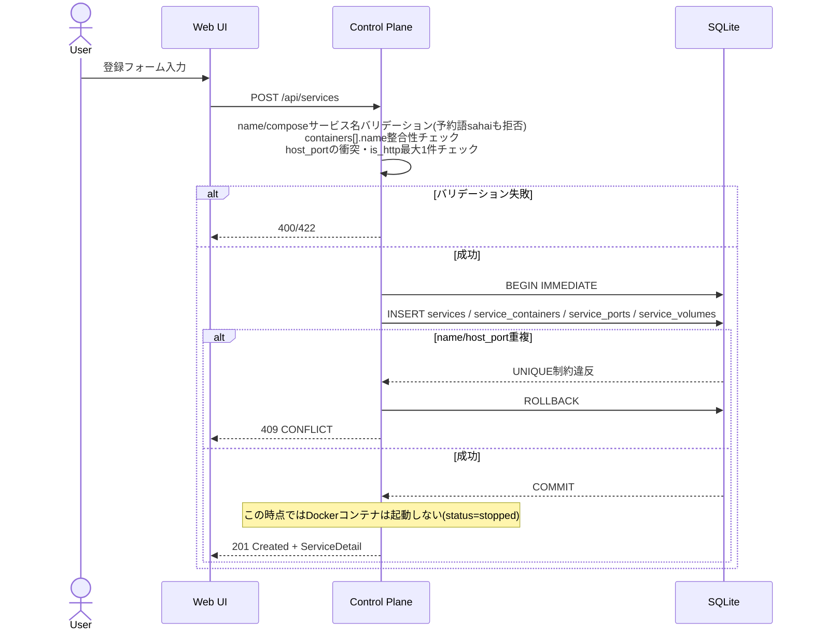
```mermaid
sequenceDiagram
    actor User
    participant WebUI as Web UI
    participant CP as Control Plane
    participant DB as SQLite

    User->>WebUI: 登録フォーム入力
    WebUI->>CP: POST /api/services
    CP->>CP: name/composeサービス名バリデーション(予約語sahaiも拒否)<br/>containers[].name整合性チェック<br/>host_portの衝突・is_http最大1件チェック
    alt バリデーション失敗
        CP-->>WebUI: 400/422
    else 成功
        CP->>DB: BEGIN IMMEDIATE
        CP->>DB: INSERT services / service_containers / service_ports / service_volumes
        alt name/host_port重複
            DB-->>CP: UNIQUE制約違反
            CP->>DB: ROLLBACK
            CP-->>WebUI: 409 CONFLICT
        else 成功
            DB-->>CP: COMMIT
            Note over CP: この時点ではDockerコンテナは起動しない(status=stopped)
            CP-->>WebUI: 201 Created + ServiceDetail
        end
    end
```

Traefikルートはこの時点では書き出さない(下記「3. 起動」参照。ルート生成はstart/restart時に統一)。

## 2. CLI push(`sahai container push`)〜任意でデプロイ

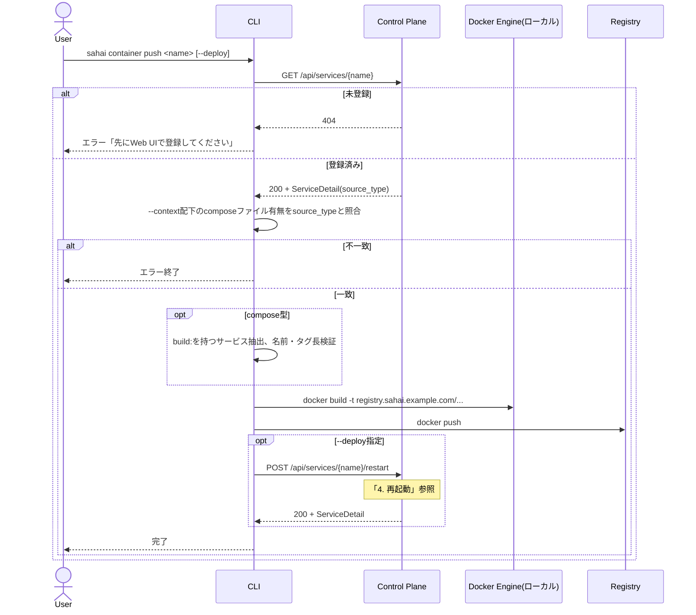
```mermaid
sequenceDiagram
    actor User
    participant CLI
    participant CP as Control Plane
    participant Docker as Docker Engine(ローカル)
    participant Registry

    User->>CLI: sahai container push <name> [--deploy]
    CLI->>CP: GET /api/services/{name}
    alt 未登録
        CP-->>CLI: 404
        CLI-->>User: エラー「先にWeb UIで登録してください」
    else 登録済み
        CP-->>CLI: 200 + ServiceDetail(source_type)
        CLI->>CLI: --context配下のcomposeファイル有無をsource_typeと照合
        alt 不一致
            CLI-->>User: エラー終了
        else 一致
            opt compose型
                CLI->>CLI: build:を持つサービス抽出、名前・タグ長検証
            end
            CLI->>Docker: docker build -t registry.sahai.example.com/...
            CLI->>Registry: docker push
            opt --deploy指定
                CLI->>CP: POST /api/services/{name}/restart
                Note over CP: 「4. 再起動」参照
                CP-->>CLI: 200 + ServiceDetail
            end
            CLI-->>User: 完了
        end
    end
```

## 2.5 CLIアップロード登録・更新(`sahai service create` / `sahai service update`)

2章の`container push`が利用者のマシンでビルドするのに対し、こちらはプロジェクト一式をサーバーへ送り、**サーバー側でビルド+push**する(要件定義書5章・12章)。レジストリの資格情報も利用者ローカルの`docker login`ではなく、Control plane自身がDBに持つ値を使う。

### 新規登録(`sahai service create`)

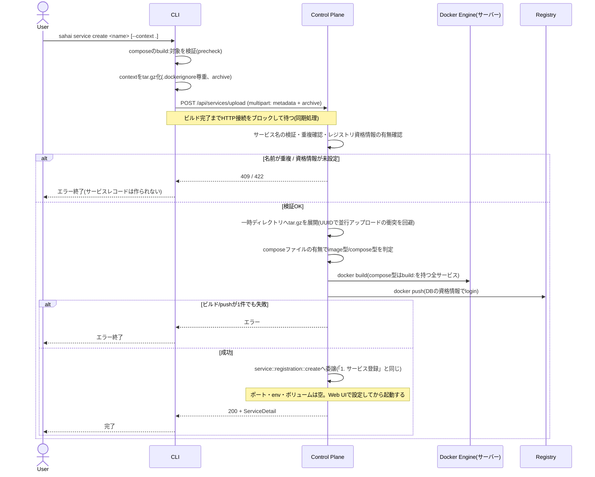
```mermaid
sequenceDiagram
    actor User
    participant CLI
    participant CP as Control Plane
    participant Docker as Docker Engine(サーバー)
    participant Registry

    User->>CLI: sahai service create <name> [--context .]
    CLI->>CLI: composeのbuild:対象を検証(precheck)
    CLI->>CLI: contextをtar.gz化(.dockerignore尊重、archive)
    CLI->>CP: POST /api/services/upload (multipart: metadata + archive)
    Note over CLI,CP: ビルド完了までHTTP接続をブロックして待つ(同期処理)
    CP->>CP: サービス名の検証・重複確認・レジストリ資格情報の有無確認
    alt 名前が重複 / 資格情報が未設定
        CP-->>CLI: 409 / 422
        CLI-->>User: エラー終了(サービスレコードは作られない)
    else 検証OK
        CP->>CP: 一時ディレクトリへtar.gzを展開(UUIDで並行アップロードの衝突を回避)
        CP->>CP: composeファイルの有無でimage型/compose型を判定
        CP->>Docker: docker build(compose型はbuild:を持つ全サービス)
        CP->>Registry: docker push(DBの資格情報でlogin)
        alt ビルド/pushが1件でも失敗
            CP-->>CLI: エラー
            CLI-->>User: エラー終了
        else 成功
            CP->>CP: service::registration::createへ委譲(「1. サービス登録」と同じ)
            Note over CP: ポート・env・ボリュームは空。Web UIで設定してから起動する
            CP-->>CLI: 200 + ServiceDetail
            CLI-->>User: 完了
        end
    end
```

ビルド→登録の順で処理するため、ビルドが失敗した場合は登録処理自体に到達せず、それがそのままロールバックになる。展開した一時ディレクトリは成功・失敗どちらの経路でも削除される。

### 更新(`sahai service update`)

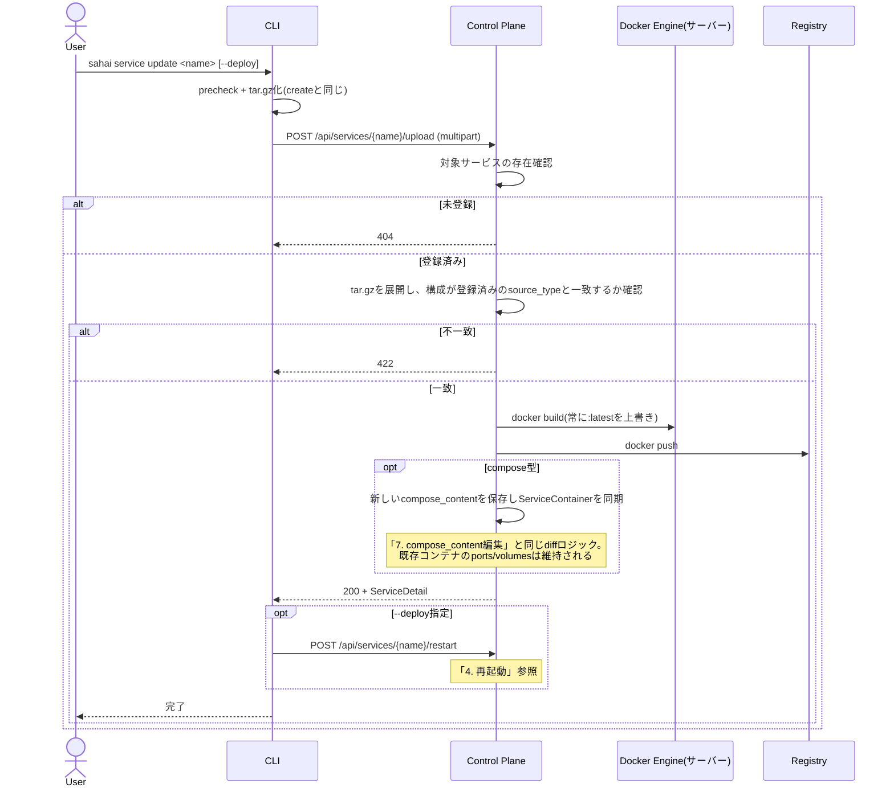
```mermaid
sequenceDiagram
    actor User
    participant CLI
    participant CP as Control Plane
    participant Docker as Docker Engine(サーバー)
    participant Registry

    User->>CLI: sahai service update <name> [--deploy]
    CLI->>CLI: precheck + tar.gz化(createと同じ)
    CLI->>CP: POST /api/services/{name}/upload (multipart)
    CP->>CP: 対象サービスの存在確認
    alt 未登録
        CP-->>CLI: 404
    else 登録済み
        CP->>CP: tar.gzを展開し、構成が登録済みのsource_typeと一致するか確認
        alt 不一致
            CP-->>CLI: 422
        else 一致
            CP->>Docker: docker build(常に:latestを上書き)
            CP->>Registry: docker push
            opt compose型
                CP->>CP: 新しいcompose_contentを保存しServiceContainerを同期
                Note over CP: 「7. compose_content編集」と同じdiffロジック。<br/>既存コンテナのports/volumesは維持される
            end
            CP-->>CLI: 200 + ServiceDetail
            opt --deploy指定
                CLI->>CP: POST /api/services/{name}/restart
                Note over CP: 「4. 再起動」参照
            end
            CLI-->>User: 完了
        end
    end
```

`--deploy`を付けない場合、ビルドしたイメージと保存した`compose_content`の実際の反映には別途restartが必要(他のメタデータ更新と同様)。

## 3. 起動(POST /api/services/{id}/start)

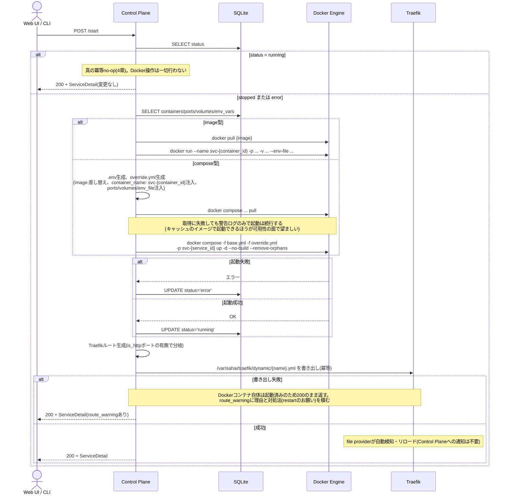
```mermaid
sequenceDiagram
    actor Caller as Web UI / CLI
    participant CP as Control Plane
    participant DB as SQLite
    participant Docker as Docker Engine
    participant Traefik

    Caller->>CP: POST /start
    CP->>DB: SELECT status
    alt status = running
        Note over CP: 真の冪等no-op(4章)。Docker操作は一切行わない
        CP-->>Caller: 200 + ServiceDetail(変更なし)
    else stopped または error
        CP->>DB: SELECT containers/ports/volumes/env_vars
        alt image型
            CP->>Docker: docker pull {image}
            CP->>Docker: docker run --name svc-{container_id} -p ... -v ... --env-file ...
        else compose型
            CP->>CP: .env生成、override.yml生成<br/>(image:差し替え、container_name: svc-{container_id}注入、<br/>ports/volumes/env_file注入)
            CP->>Docker: docker compose ... pull
            Note over CP,Docker: 取得に失敗しても警告ログのみで起動は続行する<br/>(キャッシュのイメージで起動できるほうが可用性の面で望ましい)
            CP->>Docker: docker compose -f base.yml -f override.yml<br/>-p svc-{service_id} up -d --no-build --remove-orphans
        end
        alt 起動失敗
            Docker-->>CP: エラー
            CP->>DB: UPDATE status='error'
        else 起動成功
            Docker-->>CP: OK
            CP->>DB: UPDATE status='running'
        end
        CP->>CP: Traefikルート生成(is_httpポートの有無で分岐)
        CP->>Traefik: /var/sahai/traefik/dynamic/{name}.yml を書き出し(冪等)
        alt 書き出し失敗
            Note over CP,Traefik: Dockerコンテナ自体は起動済みのため200のまま返す。<br/>route_warningに理由と対処法(restartのお願い)を積む
            CP-->>Caller: 200 + ServiceDetail(route_warningあり)
        else 成功
            Note over Traefik: file providerが自動検知・リロード(Control Planeへの通知は不要)
            CP-->>Caller: 200 + ServiceDetail
        end
    end
```

## 4. 停止(POST /api/services/{id}/stop)・再起動(POST .../restart)

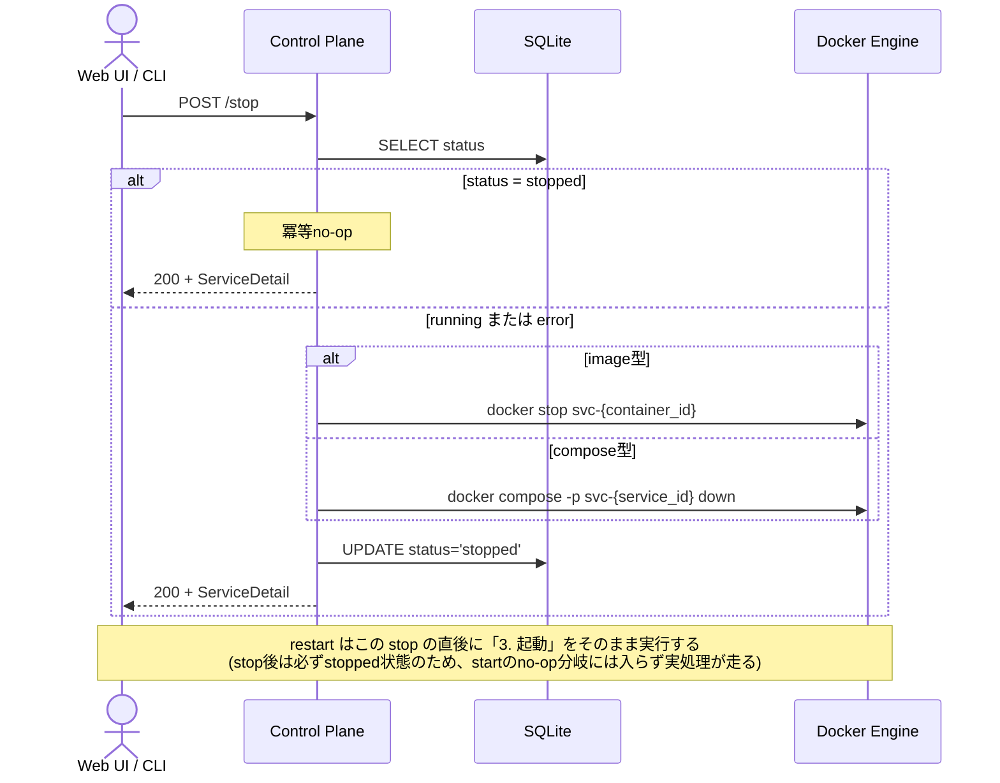
```mermaid
sequenceDiagram
    actor Caller as Web UI / CLI
    participant CP as Control Plane
    participant DB as SQLite
    participant Docker as Docker Engine

    Caller->>CP: POST /stop
    CP->>DB: SELECT status
    alt status = stopped
        Note over CP: 冪等no-op
        CP-->>Caller: 200 + ServiceDetail
    else running または error
        alt image型
            CP->>Docker: docker stop svc-{container_id}
        else compose型
            CP->>Docker: docker compose -p svc-{service_id} down
        end
        CP->>DB: UPDATE status='stopped'
        CP-->>Caller: 200 + ServiceDetail
    end

    Note over Caller,Docker: restart はこの stop の直後に「3. 起動」をそのまま実行する<br/>(stop後は必ずstopped状態のため、startのno-op分岐には入らず実処理が走る)
```

## 5. サービス削除(DELETE /api/services/{id})

外側(Traefikルート)→中間(コンテナ)→中心(DBレコード)の順で処理する(要件定義書7章)。

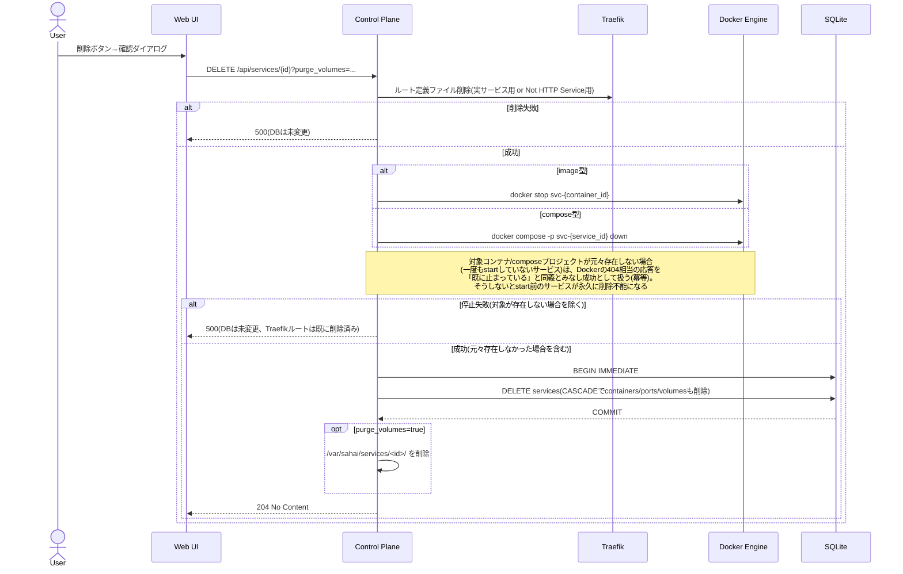
```mermaid
sequenceDiagram
    actor User
    participant WebUI as Web UI
    participant CP as Control Plane
    participant Traefik
    participant Docker as Docker Engine
    participant DB as SQLite

    User->>WebUI: 削除ボタン→確認ダイアログ
    WebUI->>CP: DELETE /api/services/{id}?purge_volumes=...
    CP->>Traefik: ルート定義ファイル削除(実サービス用 or Not HTTP Service用)
    alt 削除失敗
        CP-->>WebUI: 500(DBは未変更)
    else 成功
        alt image型
            CP->>Docker: docker stop svc-{container_id}
        else compose型
            CP->>Docker: docker compose -p svc-{service_id} down
        end
        Note over CP,Docker: 対象コンテナ/composeプロジェクトが元々存在しない場合<br/>(一度もstartしていないサービス)は、Dockerの404相当の応答を<br/>「既に止まっている」と同義とみなし成功として扱う(冪等)。<br/>そうしないとstart前のサービスが永久に削除不能になる
        alt 停止失敗(対象が存在しない場合を除く)
            CP-->>WebUI: 500(DBは未変更、Traefikルートは既に削除済み)
        else 成功(元々存在しなかった場合を含む)
            CP->>DB: BEGIN IMMEDIATE
            CP->>DB: DELETE services(CASCADEでcontainers/ports/volumesも削除)
            DB-->>CP: COMMIT
            opt purge_volumes=true
                CP->>CP: /var/sahai/services/<id>/ を削除
            end
            CP-->>WebUI: 204 No Content
        end
    end
```

## 6. サービス名変更(PUT /api/services/{id} with `name`)

`name`の変更のみ、restartを待たず即時に反映される(他フィールドと異なる特別扱い。要件定義書6章・7章)。

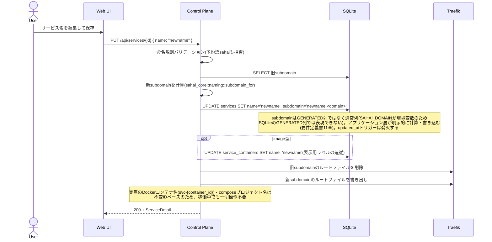
```mermaid
sequenceDiagram
    actor User
    participant WebUI as Web UI
    participant CP as Control Plane
    participant DB as SQLite
    participant Traefik

    User->>WebUI: サービス名を編集して保存
    WebUI->>CP: PUT /api/services/{id} { name: "newname" }
    CP->>CP: 命名規則バリデーション(予約語sahaiも拒否)
    CP->>DB: SELECT 旧subdomain
    CP->>CP: 新subdomainを計算(sahai_core::naming::subdomain_for)
    CP->>DB: UPDATE services SET name='newname', subdomain='newname.<domain>'
    Note over DB: subdomainはGENERATED列ではなく通常列(SAHAI_DOMAINが環境変数のため<br/>SQLiteのGENERATED列では表現できない)。アプリケーション層が明示的に計算・書き込む<br/>(要件定義書11章)。updated_atトリガーは発火する
    opt image型
        CP->>DB: UPDATE service_containers SET name='newname'(表示用ラベルの追従)
    end
    CP->>Traefik: 旧subdomainのルートファイルを削除
    CP->>Traefik: 新subdomainのルートファイルを書き出し
    Note over CP: 実際のDockerコンテナ名(svc-{container_id})・composeプロジェクト名は<br/>不変IDベースのため、稼働中でも一切操作不要
    CP-->>WebUI: 200 + ServiceDetail
```

## 7. compose_content編集(PUT /api/services/{id} with `compose_content`)

保存のみ即座に行われ、実際のDocker反映は次回start/restart時(要件定義書6章)。

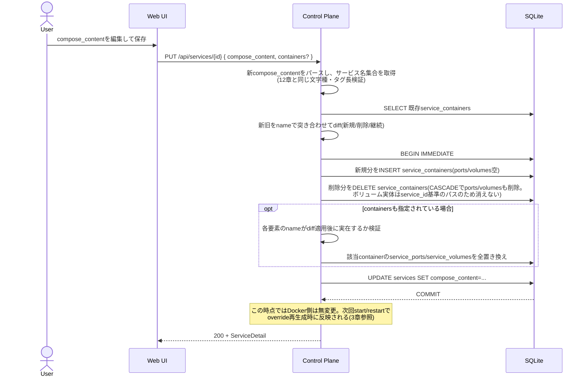
```mermaid
sequenceDiagram
    actor User
    participant WebUI as Web UI
    participant CP as Control Plane
    participant DB as SQLite

    User->>WebUI: compose_contentを編集して保存
    WebUI->>CP: PUT /api/services/{id} { compose_content, containers? }
    CP->>CP: 新compose_contentをパースし、サービス名集合を取得<br/>(12章と同じ文字種・タグ長検証)
    CP->>DB: SELECT 既存service_containers
    CP->>CP: 新旧をnameで突き合わせてdiff(新規/削除/継続)
    CP->>DB: BEGIN IMMEDIATE
    CP->>DB: 新規分をINSERT service_containers(ports/volumes空)
    CP->>DB: 削除分をDELETE service_containers(CASCADEでports/volumesも削除。<br/>ボリューム実体はservice_id基準のパスのため消えない)
    opt containersも指定されている場合
        CP->>CP: 各要素のnameがdiff適用後に実在するか検証
        CP->>DB: 該当containerのservice_ports/service_volumesを全置き換え
    end
    CP->>DB: UPDATE services SET compose_content=...
    DB-->>CP: COMMIT
    Note over CP: この時点ではDocker側は無変更。次回start/restartで<br/>override再生成時に反映される(3章参照)
    CP-->>WebUI: 200 + ServiceDetail
```

## 8. ヘルスチェック(バックグラウンドタスク)

APIリクエストとは独立に、Control Plane起動時から10秒間隔で回り続ける。

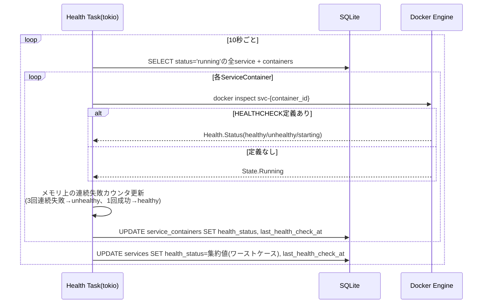
```mermaid
sequenceDiagram
    participant HT as Health Task(tokio)
    participant DB as SQLite
    participant Docker as Docker Engine

    loop 10秒ごと
        HT->>DB: SELECT status='running'の全service + containers
        loop 各ServiceContainer
            HT->>Docker: docker inspect svc-{container_id}
            alt HEALTHCHECK定義あり
                Docker-->>HT: Health.Status(healthy/unhealthy/starting)
            else 定義なし
                Docker-->>HT: State.Running
            end
            HT->>HT: メモリ上の連続失敗カウンタ更新<br/>(3回連続失敗→unhealthy、1回成功→healthy)
            HT->>DB: UPDATE service_containers SET health_status, last_health_check_at
        end
        HT->>DB: UPDATE services SET health_status=集約値(ワーストケース), last_health_check_at
    end
```

Web UIはこのDB更新結果を数秒間隔のポーリング(`GET /api/services`または`.../health`)で取得するだけで、Health Task を直接呼び出すことはない。

## 9. 実サービスへのアクセス(参考: 通常のHTTPリクエスト経路)

管理系のシーケンスではないが、Traefikがどこにリクエストを流すかを明確にしておく。`is_http`ポートがある場合、Control Planeはリクエストの経路に一切関与しない。

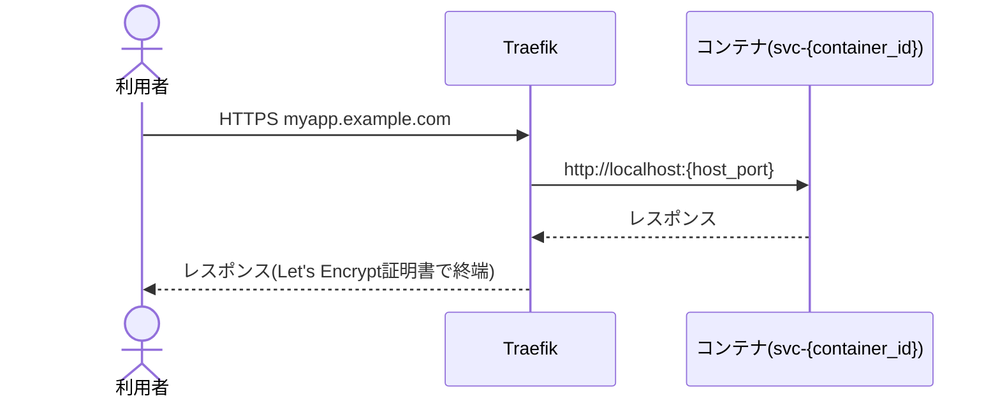
```mermaid
sequenceDiagram
    actor User as 利用者
    participant Traefik
    participant Docker as コンテナ(svc-{container_id})

    User->>Traefik: HTTPS myapp.example.com
    Traefik->>Docker: http://localhost:{host_port}
    Docker-->>Traefik: レスポンス
    Traefik-->>User: レスポンス(Let's Encrypt証明書で終端)
```

## 10. 非HTTPサービス・未登録サブドメインへのアクセス(Not Serviceページ)

`is_http`ポートがないサービス、および未登録のサブドメインの両方を、Control plane自身が受ける設計に統一している(要件定義書6章)。ただしSPAは`/`で起動すると認証ゲートに落ちてログイン画面になってしまうため、**SPAを返す前にHostヘッダーを見て`/not-service`へ寄せる**。実際にどのサービスか(あるいは未登録か)を判定するのは、そこから先のブラウザ上のJavaScriptの役目になる。

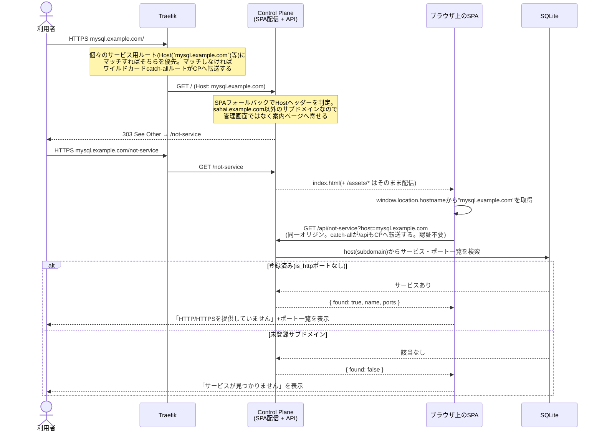
```mermaid
sequenceDiagram
    actor User as 利用者
    participant Traefik
    participant CP as Control Plane<br/>(SPA配信 + API)
    participant SPA as ブラウザ上のSPA
    participant DB as SQLite

    User->>Traefik: HTTPS mysql.example.com/
    Note over Traefik: 個々のサービス用ルート(Host(`mysql.example.com`)等)に<br/>マッチすればそちらを優先。マッチしなければ<br/>ワイルドカードcatch-allルートがCPへ転送する
    Traefik->>CP: GET / (Host: mysql.example.com)
    Note over CP: SPAフォールバックでHostヘッダーを判定。<br/>sahai.example.com以外のサブドメインなので<br/>管理画面ではなく案内ページへ寄せる
    CP-->>User: 303 See Other → /not-service
    User->>Traefik: HTTPS mysql.example.com/not-service
    Traefik->>CP: GET /not-service
    CP-->>SPA: index.html(+ /assets/* はそのまま配信)
    SPA->>SPA: window.location.hostnameから"mysql.example.com"を取得
    SPA->>CP: GET /api/not-service?host=mysql.example.com<br/>(同一オリジン。catch-allが/apiもCPへ転送する。認証不要)
    CP->>DB: host(subdomain)からサービス・ポート一覧を検索
    alt 登録済み(is_httpポートなし)
        DB-->>CP: サービスあり
        CP-->>SPA: { found: true, name, ports }
        SPA-->>User: 「HTTP/HTTPSを提供していません」+ポート一覧を表示
    else 未登録サブドメイン
        DB-->>CP: 該当なし
        CP-->>SPA: { found: false }
        SPA-->>User: 「サービスが見つかりません」を表示
    end
```

## 11. Web UIログイン(認証トークンの入力・保持)

CLIの`sahai login`(2章)に相当する、Web UI側でのトークン管理フロー。要件定義書4章「Web UI側のトークン管理」参照。

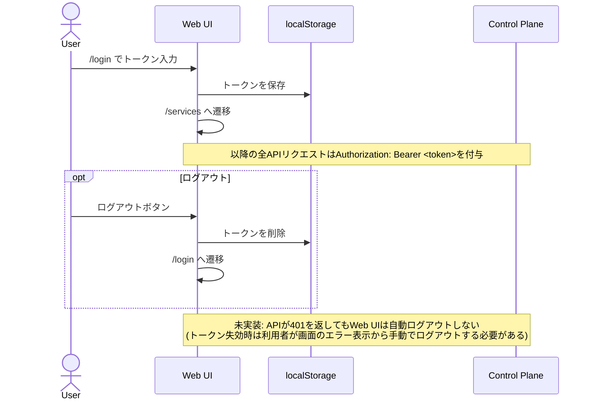
```mermaid
sequenceDiagram
    actor User
    participant WebUI as Web UI
    participant LS as localStorage
    participant CP as Control Plane

    User->>WebUI: /login でトークン入力
    WebUI->>LS: トークンを保存
    WebUI->>WebUI: /services へ遷移
    Note over WebUI,CP: 以降の全APIリクエストはAuthorization: Bearer <token>を付与

    opt ログアウト
        User->>WebUI: ログアウトボタン
        WebUI->>LS: トークンを削除
        WebUI->>WebUI: /login へ遷移
    end

    Note over WebUI,CP: 未実装: APIが401を返してもWeb UIは自動ログアウトしない<br/>(トークン失効時は利用者が画面のエラー表示から手動でログアウトする必要がある)
```

## 12. 初期セットアップ(POST /api/setup)

APIトークンがまだ存在しない段階の設定のため、通常のBearer認証は使えない。代わりに**サーバーが起動時に発行したセットアップトークン**の提示を要求し、第三者による初期設定の先取りを防ぐ(要件定義書4章「セキュリティモデル」)。

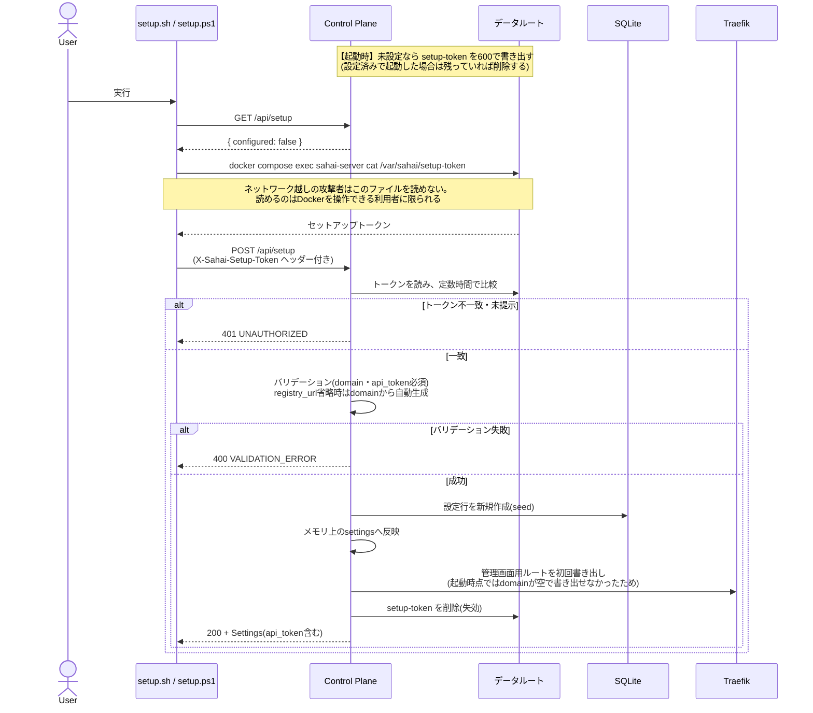
```mermaid
sequenceDiagram
    actor User
    participant Script as setup.sh / setup.ps1
    participant CP as Control Plane
    participant FS as データルート
    participant DB as SQLite
    participant Traefik

    Note over CP,FS: 【起動時】未設定なら setup-token を600で書き出す<br/>(設定済みで起動した場合は残っていれば削除する)
    User->>Script: 実行
    Script->>CP: GET /api/setup
    CP-->>Script: { configured: false }
    Script->>FS: docker compose exec sahai-server cat /var/sahai/setup-token
    Note over Script,FS: ネットワーク越しの攻撃者はこのファイルを読めない。<br/>読めるのはDockerを操作できる利用者に限られる
    FS-->>Script: セットアップトークン
    Script->>CP: POST /api/setup<br/>(X-Sahai-Setup-Token ヘッダー付き)
    CP->>FS: トークンを読み、定数時間で比較
    alt トークン不一致・未提示
        CP-->>Script: 401 UNAUTHORIZED
    else 一致
        CP->>CP: バリデーション(domain・api_token必須)<br/>registry_url省略時はdomainから自動生成
        alt バリデーション失敗
            CP-->>Script: 400 VALIDATION_ERROR
        else 成功
            CP->>DB: 設定行を新規作成(seed)
            CP->>CP: メモリ上のsettingsへ反映
            CP->>Traefik: 管理画面用ルートを初回書き出し<br/>(起動時点ではdomainが空で書き出せなかったため)
            CP->>FS: setup-token を削除(失効)
            CP-->>Script: 200 + Settings(api_token含む)
        end
    end
```

## 13. 基本設定の変更(PUT /api/settings)

`domain`/`https_redirect`/`registry_url`/`api_token`を保存後すぐに反映する(要件定義書4章「セキュリティモデル」参照)。`dns_provider`/`acme_email`はこの画面では変更できない(12章参照)。

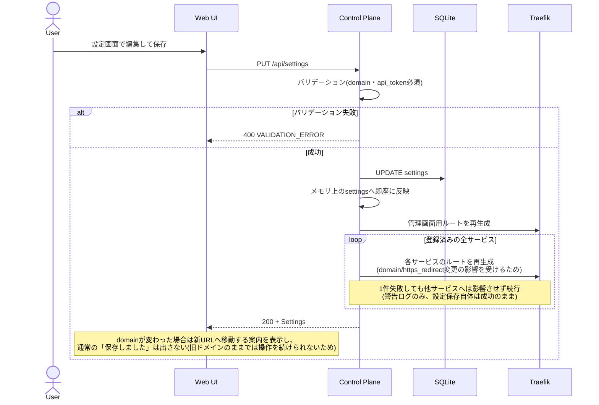
```mermaid
sequenceDiagram
    actor User
    participant WebUI as Web UI
    participant CP as Control Plane
    participant DB as SQLite
    participant Traefik

    User->>WebUI: 設定画面で編集して保存
    WebUI->>CP: PUT /api/settings
    CP->>CP: バリデーション(domain・api_token必須)
    alt バリデーション失敗
        CP-->>WebUI: 400 VALIDATION_ERROR
    else 成功
        CP->>DB: UPDATE settings
        CP->>CP: メモリ上のsettingsへ即座に反映
        CP->>Traefik: 管理画面用ルートを再生成
        loop 登録済みの全サービス
            CP->>Traefik: 各サービスのルートを再生成<br/>(domain/https_redirect変更の影響を受けるため)
            Note over CP,Traefik: 1件失敗しても他サービスへは影響させず続行<br/>(警告ログのみ、設定保存自体は成功のまま)
        end
        CP-->>WebUI: 200 + Settings
        Note over WebUI: domainが変わった場合は新URLへ移動する案内を表示し、<br/>通常の「保存しました」は出さない(旧ドメインのままでは操作を続けられないため)
    end
```

## 14. DNS/証明書設定の変更(PUT /api/settings/dns-provider)

Traefikの`certificatesResolvers`は起動時の静的設定(CLI引数)としてしか渡せず、動的ファイルのホットリロード対象外のため、この保存操作だけはTraefikコンテナ自体の再作成を伴う特別な処理になる(container-design.md 4章参照)。

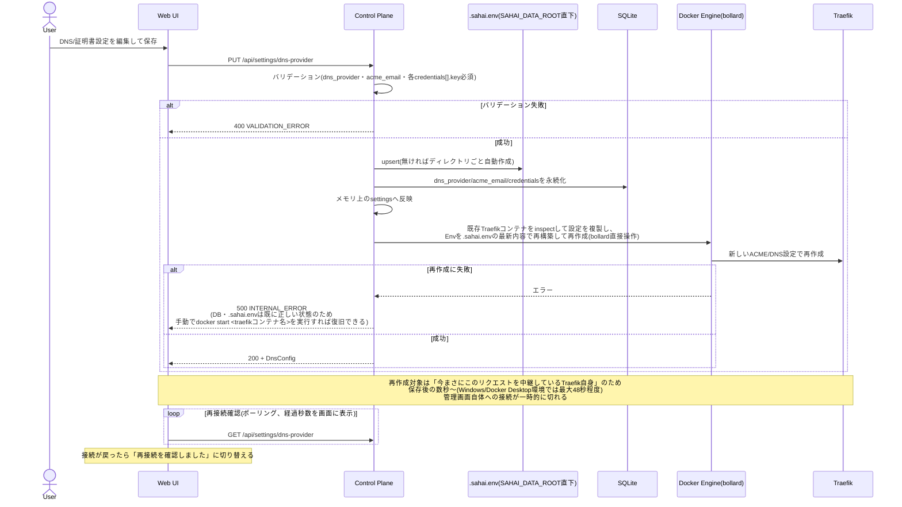
```mermaid
sequenceDiagram
    actor User
    participant WebUI as Web UI
    participant CP as Control Plane
    participant Env as .sahai.env(SAHAI_DATA_ROOT直下)
    participant DB as SQLite
    participant Docker as Docker Engine(bollard)
    participant Traefik

    User->>WebUI: DNS/証明書設定を編集して保存
    WebUI->>CP: PUT /api/settings/dns-provider
    CP->>CP: バリデーション(dns_provider・acme_email・各credentials[].key必須)
    alt バリデーション失敗
        CP-->>WebUI: 400 VALIDATION_ERROR
    else 成功
        CP->>Env: upsert(無ければディレクトリごと自動作成)
        CP->>DB: dns_provider/acme_email/credentialsを永続化
        CP->>CP: メモリ上のsettingsへ反映
        CP->>Docker: 既存Traefikコンテナをinspectして設定を複製し、<br/>Envを.sahai.envの最新内容で再構築して再作成(bollard直接操作)
        Docker->>Traefik: 新しいACME/DNS設定で再作成
        alt 再作成に失敗
            Docker-->>CP: エラー
            CP-->>WebUI: 500 INTERNAL_ERROR<br/>(DB・.sahai.envは既に正しい状態のため<br/>手動でdocker start <traefikコンテナ名>を実行すれば復旧できる)
        else 成功
            CP-->>WebUI: 200 + DnsConfig
        end
    end
    Note over WebUI,Traefik: 再作成対象は「今まさにこのリクエストを中継しているTraefik自身」のため<br/>保存後の数秒〜(Windows/Docker Desktop環境では最大48秒程度)<br/>管理画面自体への接続が一時的に切れる
    loop 再接続確認(ポーリング、経過秒数を画面に表示)
        WebUI->>CP: GET /api/settings/dns-provider
    end
    Note over WebUI: 接続が戻ったら「再接続を確認しました」に切り替える
```
